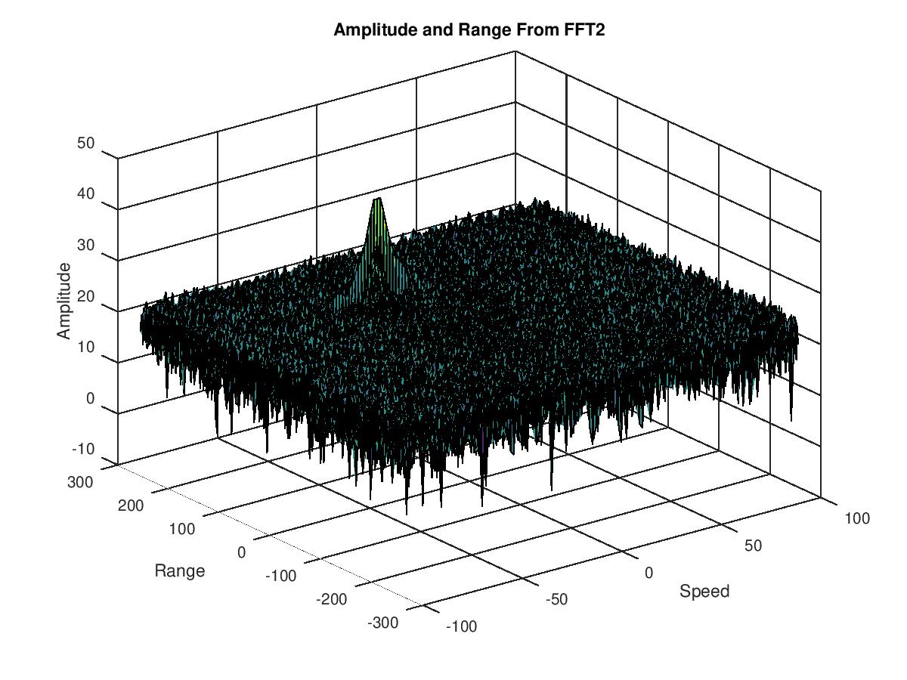
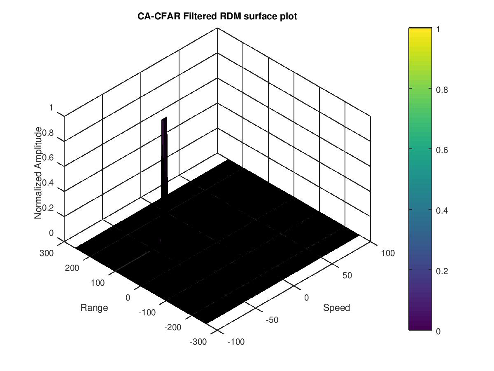

# Radar Target Generation and Detection

## Implementation steps

Calculate the Training cell count for each dimension and also designate the number of guard cells. Progressively traverse the cell under test throughout the entire matrix, ensuring that the CUT maintains a buffer for Training and Guard cells along the edges.

For each iteration, aggregate the signal levels within all the training cells. Convert the cumulative value from logarithmic to linear using the db2pow function. Compute the average of the summed values across all utilized training cells. Once averaged, revert the value back to logarithmic using pow2db.

Add the specified offset to determine the threshold. Subsequently, compare the signal under the CUT with this threshold. If the CUT level surpasses the threshold, assign it a value of 1; otherwise, set it to 0.

## Selection of training, guard cells and offset

The chosen values were derived through fine-tuning for accuracy. Additionally, it's worth noting that as the number of cells increases, the runtime of the program also extends.

Tr = 12; Td = 6;
Gr = 6; Gd = 3;
offset = 1.4; (by SNR in dB)

## Steps taken to suppress the non-thresholded cells at the edges

The minimal number of non-thresholded cells is adjusted to zero by generating a logical index for cells that have not undergone thresholding, resulting in values of either zero or one. This ensures that the map size remains consistent with its state before applying Constant False Alarm Rate (CFAR).

RDM(RDM~=0 & RDM~=1) = 0

Amplitude and range from FFT2

CFAR filtered RDM surface plot
